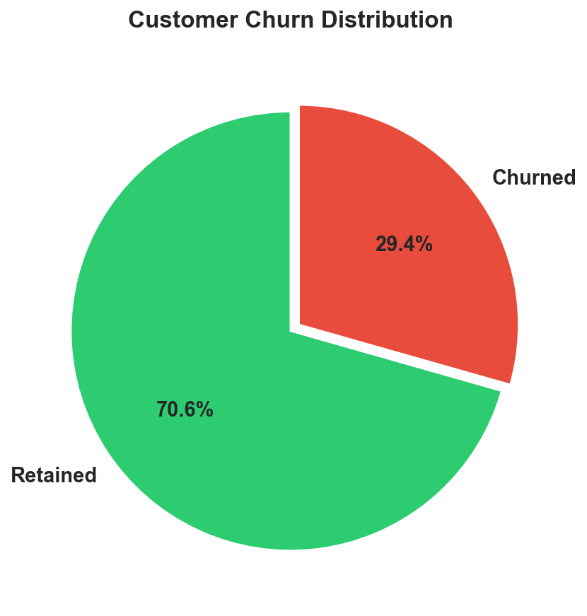
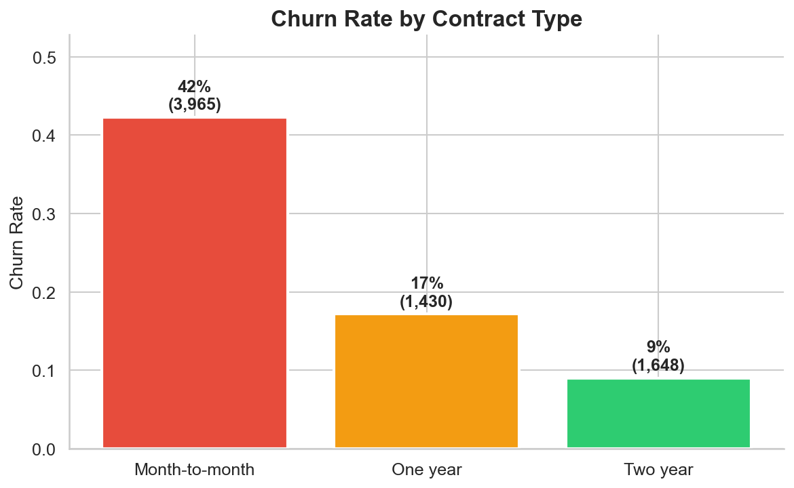
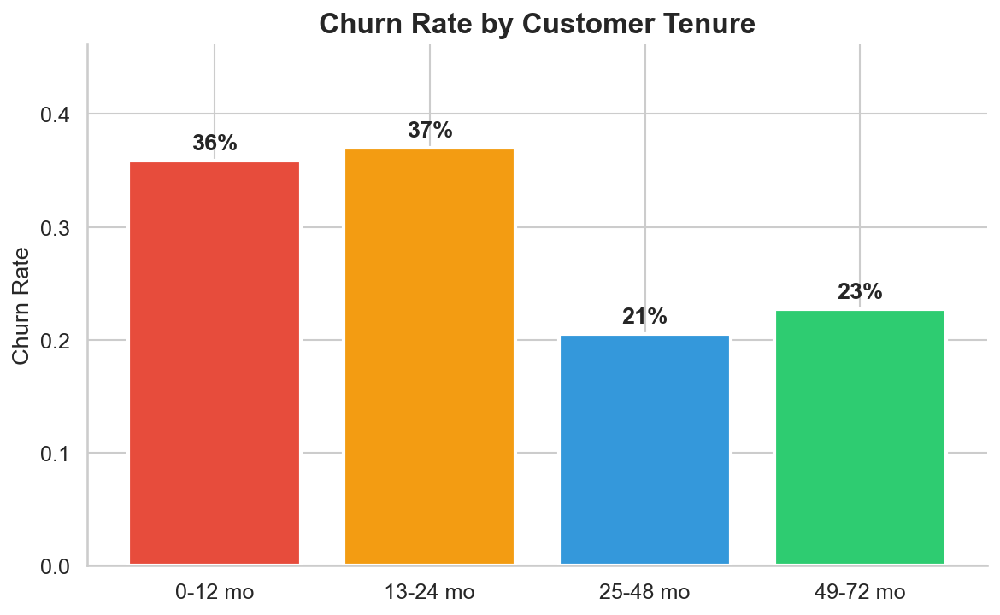
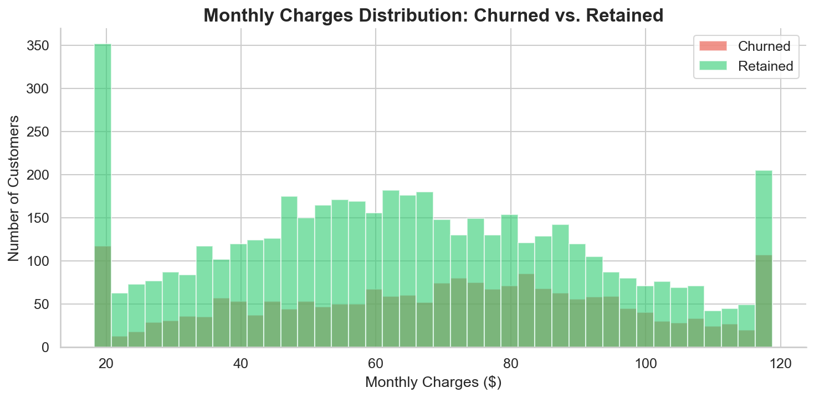
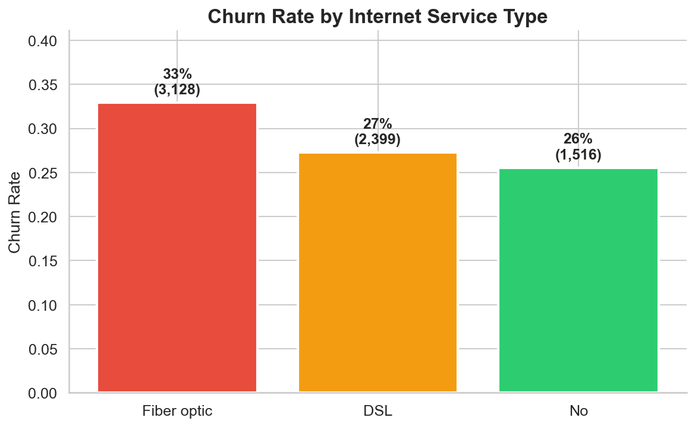
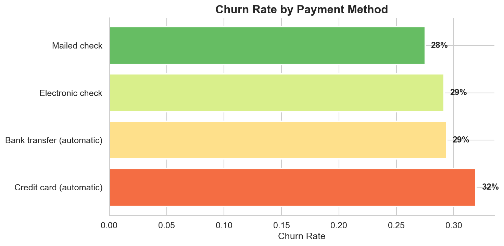
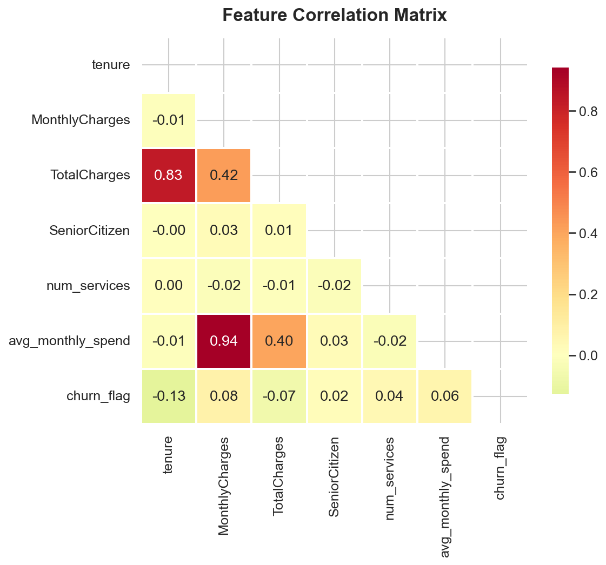
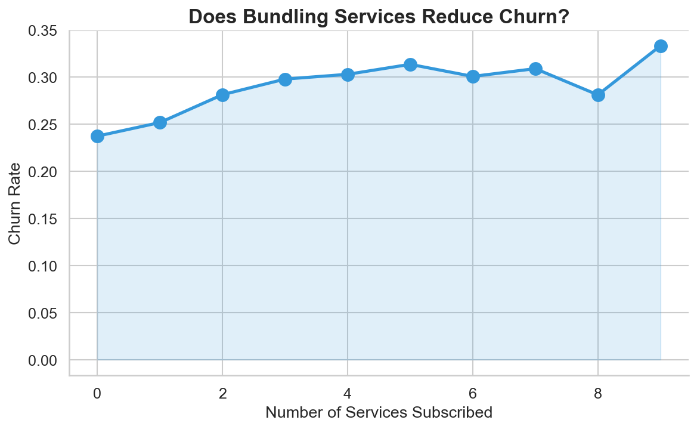

# Customer Churn Analysis & Prediction

**Author:** Stephen Drani
**Tools:** Python (Pandas, NumPy, Matplotlib, Seaborn, Scikit-learn), Looker Studio
**Dataset:** IBM Telco Customer Churn — 7,043 customers, 21 features

## Business Question

A telecom company is losing customers and wants to understand **why customers leave** and **which customers are most likely to churn next month**, so the retention team can take proactive action before it's too late.

## Project Overview

This project walks through the full data analyst pipeline: data cleaning, exploratory analysis, predictive modeling, and actionable business recommendations — ending with an interactive Looker Studio dashboard for stakeholders.

## Key Findings

**1. Month-to-month contracts are the #1 churn driver** — these customers churn at 42%, compared to 17% for annual and 9% for two-year contracts. Converting even 10% of month-to-month customers to annual contracts could save ~$14K/month in revenue.

**2. The first 12 months are make-or-break** — new customers churn at the highest rate. After surviving year one, churn drops dramatically. This points to a need for a strong onboarding experience.

**3. Fiber optic customers churn more than DSL** — despite being the premium service. This suggests a pricing/value mismatch, not a quality problem.

**4. Electronic check payers churn most** — customers on auto-pay (bank transfer or credit card) are significantly stickier. Reducing friction in payments reduces churn.

**5. Bundled services reduce churn** — customers subscribed to 4+ services churn at lower rates, suggesting cross-sell and bundle strategies would improve retention.

## Visualizations

| Chart | Insight |
|-------|---------|
|  | 29.4% of customers churned |
|  | Month-to-month = 42% churn |
|  | New customers churn most |
|  | Churned customers pay more |
|  | Fiber optic churn is highest |
|  | E-check = highest churn |
|  | Feature relationships |
|  | More services = less churn |

## Prediction Model

A **logistic regression model** predicts which customers are likely to churn, achieving a ROC-AUC of ~0.74. Each customer is assigned a churn probability score and segmented into Low / Medium / High risk groups.

To run the model (requires scikit-learn):
```bash
pip install scikit-learn
python churn_analysis.py
```

The model generates three additional charts: confusion matrix, ROC curve, and feature importance coefficients.

## Interactive Dashboard

[**View the Live Dashboard on Looker Studio**](https://lookerstudio.google.com/s/ra8vaWVRUzQ)

The interactive dashboard includes KPI cards (total customers, churn rate, revenue at risk), churn breakdowns by contract type, tenure, internet service, and payment method, plus dropdown filters for stakeholder exploration.

## Project Structure

```
customer-churn-analysis/
├── churn_analysis.py          # Full analysis pipeline
├── telco_churn_raw.csv        # Raw dataset (7,043 rows)
├── churn_dashboard_data.csv   # Cleaned + enriched for Looker Studio
├── requirements.txt           # Python dependencies
├── LOOKER_SETUP.md            # Dashboard build instructions
├── README.md                  # This file
└── charts/                    # All generated visualizations
    ├── 01_churn_distribution.png
    ├── 02_churn_by_contract.png
    ├── 03_churn_by_tenure.png
    ├── 04_monthly_charges_dist.png
    ├── 05_churn_by_internet.png
    ├── 06_churn_by_payment.png
    ├── 07_correlation_heatmap.png
    └── 08_services_vs_churn.png
```

## How to Run

```bash
# Clone the repo
git clone https://github.com/worldwarwater/Data-Analytics.github.io.git
cd Data-Analytics.github.io/customer-churn-analysis

# Install dependencies
pip install -r requirements.txt

# Run the full analysis
python churn_analysis.py
```

## Skills Demonstrated

- **Data Cleaning:** Handling missing values, type conversions, feature engineering
- **Exploratory Data Analysis:** Distribution analysis, group comparisons, correlation analysis
- **Data Visualization:** Publication-quality charts with Matplotlib and Seaborn
- **Machine Learning:** Logistic regression, train/test split, ROC-AUC evaluation
- **Business Acumen:** Translating statistical findings into actionable retention strategies
- **Dashboard Design:** Exporting analysis-ready data for Looker Studio
