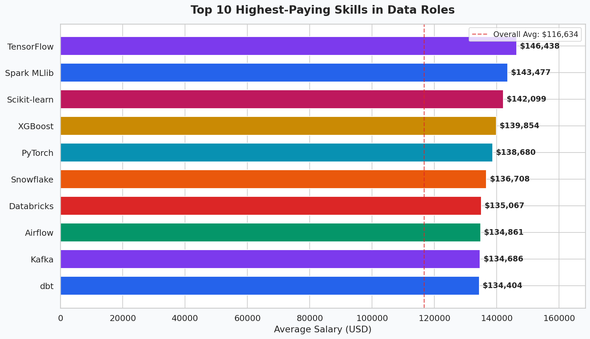
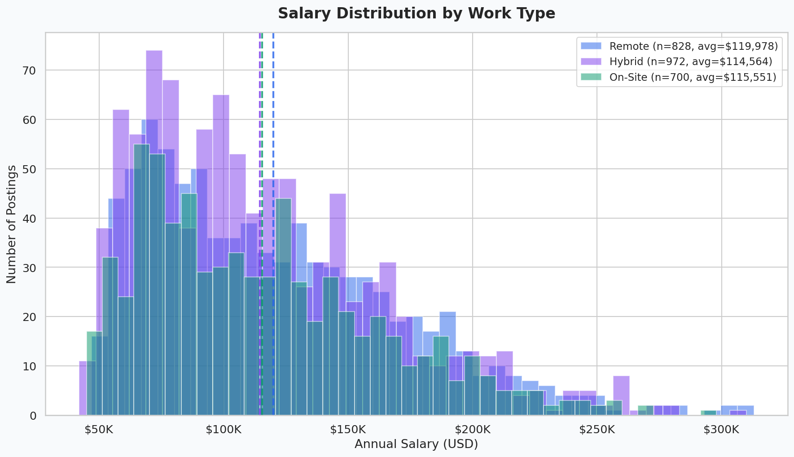
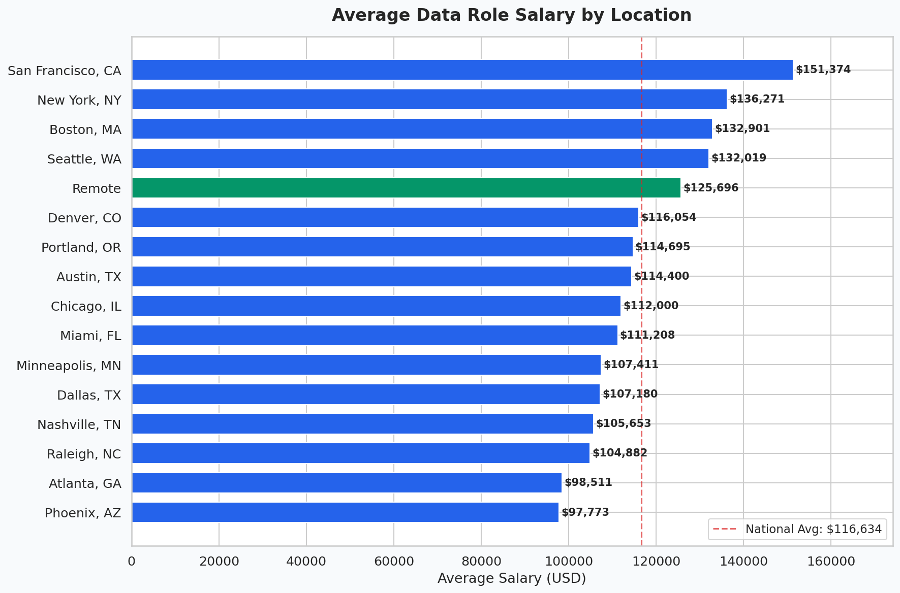
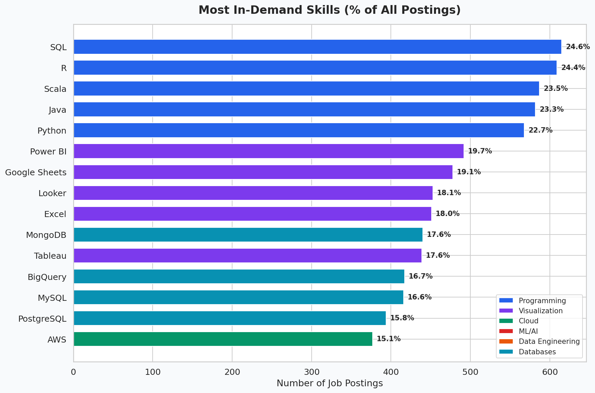
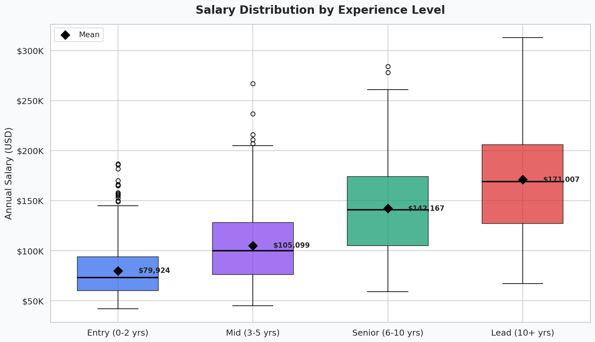
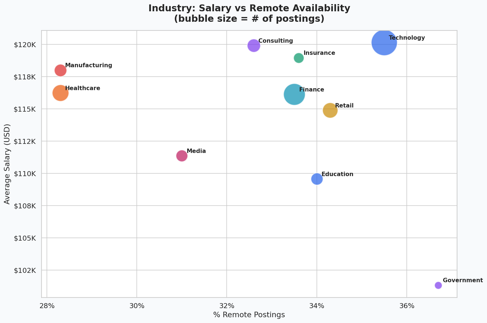
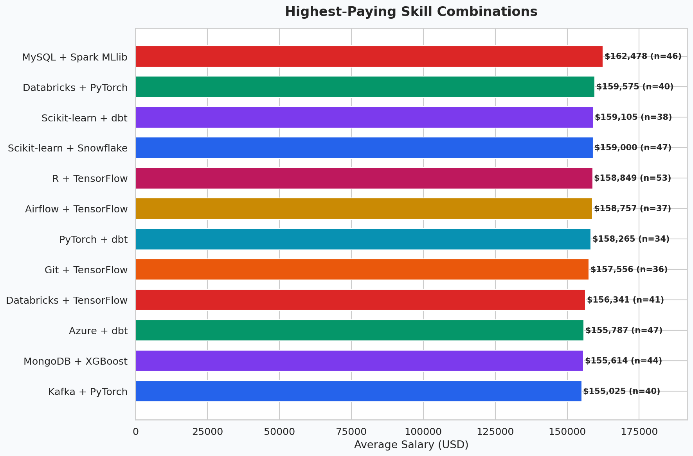
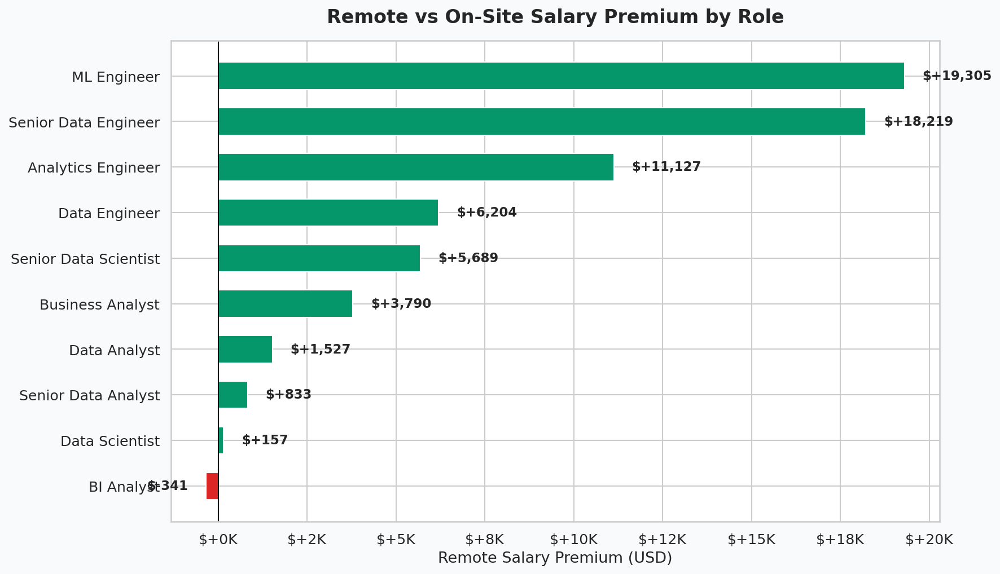

# Job Market Analysis Pipeline

**An end-to-end data pipeline analyzing 2,500 data role job postings to uncover salary trends, in-demand skills, and the remote work pay gap.**

## Business Questions

This project answers the questions every data job seeker is asking:

1. **Which skills pay the most?** — ML/AI tools (TensorFlow, Spark MLlib, Scikit-learn) command $20-30K premiums over the average
2. **Is there a remote pay gap?** — Remote roles pay ~$4,400 more on average, with the biggest premium in ML Engineer (+$19K) and Senior Data Engineer (+$18K) roles
3. **What should entry-level analysts focus on?** — Python + SQL appear in 23-25% of all postings; pair them with a visualization tool (Tableau/Power BI) for maximum coverage
4. **Which cities pay the most?** — San Francisco ($151K avg), New York ($136K), and Boston ($133K) lead, but remote roles ($126K) outpay most mid-tier cities
5. **Which skill *combinations* are most valuable?** — MySQL + Spark MLlib ($162K), Databricks + PyTorch ($160K), and Scikit-learn + dbt ($159K) top the list

## Pipeline Architecture

```
Raw CSV → SQLite Database → SQL Analysis → Python (pandas + scipy) → Visualizations → Looker Studio
```

| Stage | Tool | What It Does |
|-------|------|-------------|
| Data Generation | Python | Creates realistic synthetic dataset with salary, skills, location, experience |
| Database | SQLite | Normalized schema: `job_postings`, `job_skills`, `skill_categories` |
| SQL Analysis | 10 queries | Top skills, pay gaps, city rankings, skill pairs, industry comparison |
| Statistical Testing | scipy | T-tests, ANOVA, Chi-square, Cohen's d effect size |
| Visualization | matplotlib + seaborn | 8 publication-quality charts |
| Dashboard | Looker Studio | Interactive explorer with filters by skill, location, work type |

## Key Findings

### Salary by Experience Level
| Level | Avg Salary | Premium vs Entry |
|-------|-----------|-----------------|
| Entry (0-2 yrs) | $79,924 | — |
| Mid (3-5 yrs) | $105,099 | +31% |
| Senior (6-10 yrs) | $142,167 | +78% |
| Lead (10+ yrs) | $171,007 | +114% |

### Top 5 Highest-Paying Skills
| Skill | Avg Salary | Premium |
|-------|-----------|---------|
| TensorFlow | $146,438 | +$29,805 |
| Spark MLlib | $143,477 | +$26,843 |
| Scikit-learn | $142,099 | +$25,466 |
| XGBoost | $139,854 | +$23,220 |
| PyTorch | $138,680 | +$22,047 |

### Remote vs On-Site
| Work Type | Avg Salary | Avg Applicants |
|-----------|-----------|---------------|
| Remote | $119,978 | 140 |
| On-Site | $115,551 | 88 |
| Hybrid | $114,564 | 88 |

Remote roles pay more but attract **59% more applicants** — higher competition.

## Visualizations

| Chart | Description |
|-------|-------------|
|  | Top 10 highest-paying skills with salary premium |
|  | Salary distribution: Remote vs Hybrid vs On-Site |
|  | Average salary by metro area |
|  | Most in-demand skills by posting volume |
|  | Box plot: salary range by experience level |
|  | Bubble chart: industry salary vs remote % |
|  | Highest-paying skill combinations |
|  | Remote salary premium by job title |

## Interactive Dashboard

> **[View the Looker Studio Dashboard →](https://lookerstudio.google.com/s/g3VbO0T8B4c)**

Explore the data interactively with filters by skill, location, experience, and work type.

## How to Run

```bash
# 1. Install dependencies
pip install pandas numpy matplotlib seaborn scipy

# 2. Generate dataset
python generate_dataset.py

# 3. Run full analysis pipeline
python job_market_analysis.py
```

## Project Structure

```
job-market-analysis/
├── generate_dataset.py          # Synthetic data generator
├── job_market_analysis.py       # Main analysis pipeline
├── job_postings_2025.csv        # Raw dataset (2,500 postings)
├── job_market.db                # SQLite database
├── job_market_dashboard_data.csv # Enriched data for Looker Studio
├── skills_summary.csv           # Aggregated skills data
├── requirements.txt
├── sql/
│   ├── create_database.sql      # Database schema
│   └── analysis_queries.sql     # 10 business analysis queries
├── charts/
│   ├── 01_top_paying_skills.png
│   ├── 02_salary_by_work_type.png
│   ├── 03_salary_by_city.png
│   ├── 04_most_in_demand_skills.png
│   ├── 05_salary_by_experience.png
│   ├── 06_industry_salary_vs_remote.png
│   ├── 07_top_skill_pairs.png
│   └── 08_remote_premium_by_title.png
└── README.md
```

## Skills Demonstrated

- **SQL**: Database design, normalized schema, CTEs, window functions, aggregations, CASE expressions, JOINs
- **Python**: pandas data manipulation, numpy, statistical testing (scipy)
- **Data Visualization**: matplotlib, seaborn — 8 chart types including box plots, bubble charts, diverging bars
- **Statistical Analysis**: T-tests, ANOVA, Chi-square, Cohen's d effect size
- **Database Design**: SQLite, normalized tables, foreign keys
- **Business Storytelling**: Translating data into actionable career advice
- **Dashboard Design**: Looker Studio interactive dashboard with filters and KPIs
